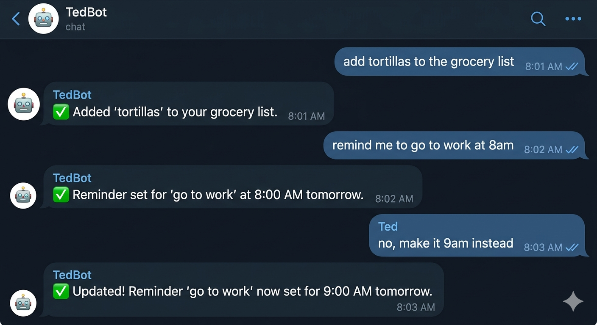
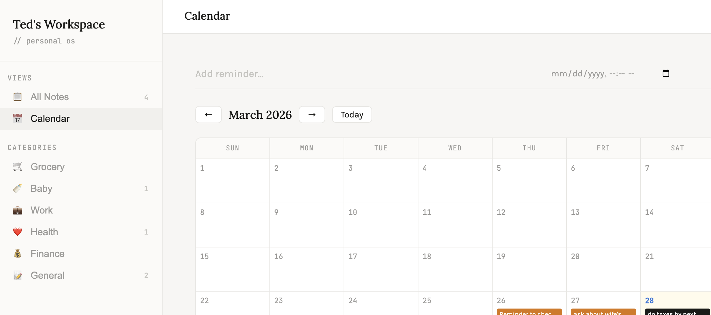

# TedBot – OpenClaw Lite for Local AI Agents



Remote bot via telegram


Local only interactive platform for displays, iPads, smartphone 

---
## TL;DR 🚀

TedBot is a personal AI agent for <$100 setup that:
- Turns natural language → calendar events, notes, and reminders
- Runs locally (CPU only) with minimal overhead
- Connects to Telegram for lightweight automation

> No cloud. No vendor lock-in. No overhead.


---

Think of it as :

> "If you wanted a fully private assistant to manage your reminders and notes, this is the solution for you"

---

## Example Use Cases

These are intentionally simple but representative:

Calendar intent extraction
> “Remind me tomorrow at 9am” **→ structured time + action**

Note summarization
> "For Project X, make sure I read up on tokenisation methods" **→Turning unstructured text into concise notes**

Action extraction
> "Add it to work category" **Identifying tasks or follow-ups from text**

## 🚩 Architecture 

```
        +----------------+
        | Telegram / CLI |
        +--------+-------+
                 |
                 v
          +------+------+
          |  TedBot AI  |
          |  (OpenClaw  |
          |   Lite)     |
          +------+------+
                 |
         +-------+-------+
         | Calendar/Notes|
         +---------------+
```

---

## Quick Start

```bash
# 1. Clone
git clone <repo>

# 2. Start system
docker compose -f docker-compose.tedbot.yml up -d

# 3. Run model
ollama run gemma3:1b
```
---
# 🔧 TedBot Troubleshooting Guide

This guide captures the real-world debugging commands, memory checks, and container orchestration tricks from the TedBot setup.

---

## 1. Ollama Model Management

| Issue | Commands / Checks | Notes / Outcome |
|-------|-----------------|----------------|
| Check running models | `ollama ps` | Lists all currently running Ollama models with memory usage. |
| Stop a misbehaving model | `ollama stop <model>` | Stops the model gracefully; check `ollama ps` afterwards. |
| Remove unwanted models | `ollama rm <model>` | Cleans up disk usage; useful when upgrading models. |
| Run a model | `ollama run <model>` | Start a model for inference. Combine with `curl` for API testing. |
| Pull / update a model | `ollama pull <model>` | Always check free memory before pulling large models. |

💡 **Pro tip:** Use `ollama list` to see all downloaded models, `ollama show <model>` for metadata.

---

## 2. Docker & Docker Compose

| Issue | Commands / Checks | Notes / Outcome |
|-------|-----------------|----------------|
| Start services | `docker compose -f docker-compose.tedbot.yml up -d` | Runs TedBot in detached mode. |
| Restart specific container | `docker restart <container>` | Useful if UI crashes but backend is fine. |
| Check logs | `docker logs -f <container>` | Continuous output; essential for debugging crashes or misfires. |
| Down & rebuild | `docker compose -f docker-compose.tedbot.yml down && docker compose -f docker-compose.tedbot.yml up -d` | Resets the container environment; solves many networking or volume issues. |
| Verify running containers | `docker ps -a` | Ensures expected containers exist and are in the correct state. |

💡 **Tip:** Always `docker logs` before restarting — avoids losing error context.

---

## 3. System Resources & Memory

| Issue | Commands / Checks | Notes / Outcome |
|-------|-----------------|----------------|
| Check RAM usage | `free -h` | Useful before starting large models; ensures you won’t hit OOM. |
| Monitor CPU usage | `top` / `watch -n 1 'ps aux --sort=-%cpu | head -15'` | Detects runaway processes consuming CPU. |
| Number of cores | `nproc` | Helps configure threading for Ollama models. |
| CPU model | `cat /proc/cpuinfo | grep "model name" | head -1` | Useful when documenting server specs. |
| Power info | `sudo dmidecode -t 39` / `sudo dmidecode -t 39 | grep -i watt` | Ensures hardware can sustain 24/7 inference. |

💡 **Pro tip:** Monitor memory and CPU while running `gemma3:1b` or `qwen2.5:3b`; Ollama is CPU-bound on small servers.

---

## 4. Ollama API Testing

| Issue | Commands / Checks | Notes / Outcome |
|-------|-----------------|----------------|
| Test API locally | `curl -s -o /dev/null -w "%{time_total}" http://localhost:11434/api/generate -d '{"model":"qwen2.5:3b","prompt":"hi","stream":false,"options":{"num_predict":5}}'` | Confirms that the model responds correctly over HTTP. |
| Verify environment | `systemctl show ollama --property=Environment` | Ensures systemd service uses correct host/port and keep-alive settings. |

---

## 5. Systemd Service Tweaks (Optional)

| Issue | Commands / Checks | Notes / Outcome |
|-------|-----------------|----------------|
| Override Ollama environment | `sudo tee /etc/systemd/system/ollama.service.d/override.conf` | Set host, port, or keep-alive options. |
| Reload & restart service | `sudo systemctl daemon-reload && sudo systemctl restart ollama` | Applies changes without rebooting. |

💡 **Pro tip:** Use environment overrides to expose Ollama for remote API calls safely.

---

## 6. Common Pitfalls

- **Memory Errors:** Always `free -h` before running 3B+ models. If OOM, stop unused models (`ollama stop <model>`).  
- **SSH Copy Confusion:** Don’t run `scp` from the remote server; always run from **local host**.  
- **Container Networking:** If API calls fail, check `docker ps` and container port bindings.  
- **Zombie Containers:** Periodically run `docker ps -a` and `docker rm` old containers.  
- **Logs Disappear:** Always run `docker logs -f tedbot` **before** restarting the container.  

---

## At a Glance
TedBot is not a single script — it is a composed system:

### UI (Dockerized)
 - Handles user interaction and input
### Backend (TedBot service)
 - Responsible for:
    - request normalization
    - prompt construction
    - response parsing (e.g., extracting structured intent)
### Ollama (Local model runtime)
 - Runs models like gemma, qwen, etc. locally
### System Layer
 - Provides:
    - process visibility
    - logs
    - latency measurement
    - resource monitoring

This separation is intentional — it mirrors how production AI systems are structured.

---
## What Problem This Solves

Most LLM applications today:

**- depend heavily on external APIs or require you to buy a Mac mini or equivalent device which costs over $100**

**- hide core behavior behind abstractions**

**- are difficult to debug or reason about**

**- do not run reliably in constrained environments**

TedBot addresses this by:

**- running fully local (no cloud dependency)**

**- exposing the entire request → inference → response pipeline**

**- making model behavior observable and debuggable**

**- operating within tight CPU and memory constraints**-

The result is a system that prioritizes control, transparency, and reliability over raw capability.
---


## 💡 What Makes This Different

Most LLM projects:
- API wrappers
- Black-box demos
- Hardcoded logic

This one:

- Runs **fully locally**
- Shows the **entire stack**
- Lets you **debug the LLM layer**
- Built for **endurance**, not demos


---

## 🚡 Performance Reality

- CPU bound by design
- Model size tradeoffs
- Smaller models = faster iteration
- Observability > raw speed

---

## 💡 Real Use Cases (this is where it shines)

- "Remind me tomorrow at 9 AM" → calendar intent
- "Summarize my notes" – KNOWLEDGE layer
- "Extract action items" – agent behavior and retrieval

---
